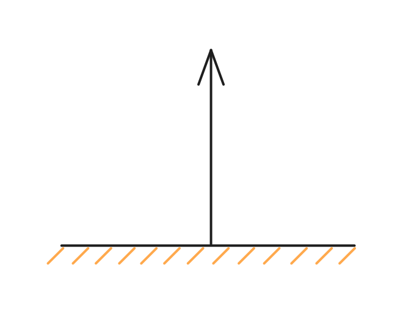
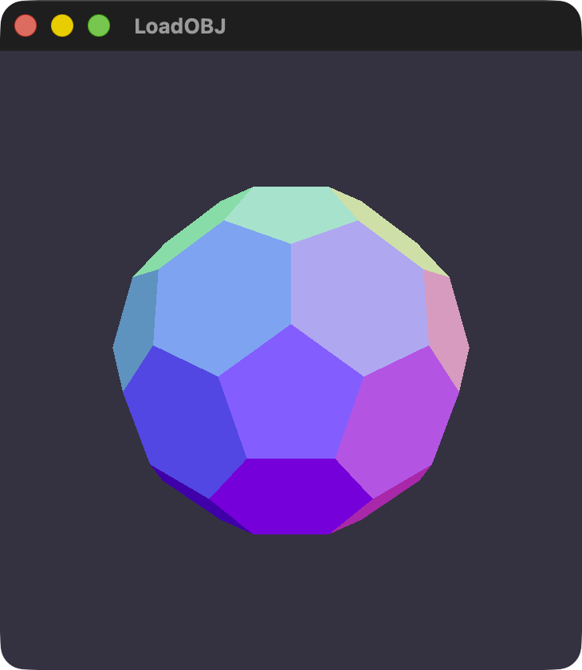
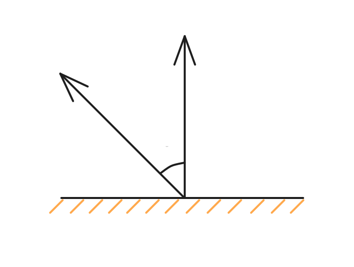
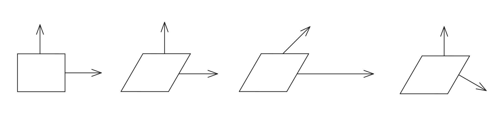

# 光照

下载以下工程作为起点：



本章节会教你如何为物体添加上光照效果，完整代码：



## 法线 Normal

在[#yong-normal-shang-se](../ru-men/jia-zai-mo-xing.md#yong-normal-shang-se "mention")中，有一个称为法线的概念没有解释，在接下来的学习中，我们需要先了解法线的定义：

法线是用来描述平面或顶点朝向的向量，在计算机中，法线是一个三维向量，通常被归一化，示意图为：



此处 N 向量为法向量，接下来我们会利用法线去计算光照和反射，但在这之前，我们现搞定法线可视化。

#### 法线可视化

上一节中渲染了一个五颜六色的模型：

<figure><figcaption><p>法线可视化的模型</p></figcaption></figure>

法线可视化是一个常用的调试手段，可以排查一些如模型内外翻转、表面黑色接缝、光线异常等错误。

它的原理是颜色由 RGBA 四个 Float 值确定，范围是 \[0, 1]，而法线是一个三维向量，将其归一化后，范围在 \[-1, 1]，如果要用法线来作为颜色，那就要将法线的取值范围 \[-1, 1] 映射到 \[0, 1]，使用以下公式：

$$
\text{Color} = \text{Normal} \times 0.5 + 0.5
$$

对法线可视化进行解读：

**从颜色解读：**

* **蓝色：**&#x8868;示**Z轴正方向，**&#x5728;**切线空间（Tangent Space）**&#x6CD5;线贴图中，蓝色代表表面是平的，垂直指出来。
* **红色：**&#x8868;示**X轴方向**。越红说明面越朝向右侧（或左侧，取决于坐标系定义）。
* **绿色：**&#x8868;示**Y轴方向，**&#x8D8A;绿说明面越朝向上方。
* **混合色：**&#x5982;果一个面朝向右上方，它就会显示红色和绿色的混合色（黄色）。

**从颜色过渡解读：**

* **颜色过渡平滑：**&#x6A21;型表面圆润
* **颜色突然断开：**&#x6A21;型此处有锋利的棱角

法线可视化忽略了纹理、光照、阴影，展示了模型的几何信息，是一个常用的调试手段。

## Lambert 光照

#### Lambert 余弦定律

想想你手上拿着一个手电筒，照射于墙面

<details>

<summary>如果你有 iPhone 的话</summary>

开启 iPhone 手电筒后，设置成聚光灯：

<figure><figcaption><p>聚光灯的 iPhone 手电筒</p></figcaption></figure>

</details>

**将光束垂直照射在墙面上：**

光斑是一个圆形，而由于所有光的能量都集中在这个圆圈中，所以这里非常亮！

**慢慢的倾斜手电筒：**

光斑变成了一个拉长的椭圆，总面积更大了，但似乎没那么亮了

从这里可以看出，光的总能量没变，但光线越倾斜，**单位面积**收到的能量就越少，看起来就越暗

#### 基于角度的解读

从上述现象可以得出，对于墙壁的单位面积光照强度与照射角度的关系是：

$$
I = I_{0} \cdot \cos(\theta)
$$

* $$I$$：代表 Intensity，表面实际接收到的光照强度。
* $$I_0$$：代表光源垂直照射时的最大强度，即光源本身的强度。
* $$\theta$$：代表入射光线与法线之间的夹角。

由此可以得出：即在一定面积内，光线与表面法线的夹角越大，表面的亮度就越低

#### 从图形学角度解读

在图形学中，计算三角函数的性能占用会高一些，通常使用使用 **点积 Dot Product** 的几何性质去计算向量相似性，在这里也就是夹角角度，即：

$$
Color_{diffuse} = K_d \cdot I_{light} \cdot \max(0, \vec{N} \cdot \vec{L})
$$

* $$\vec{N} \cdot \vec{L}$$：这里是公式的核心，根据线性代数性质：$$\vec{A} \cdot \vec{B} = |\vec{A}||\vec{B}|\cos(\theta)$$，如果法线 N 和光线 L 都归一化，那么就等同于 $$\vec{N} \cdot \vec{L} = 1 \cdot 1 \cdot \cos(\theta) = \cos(\theta)$$，所以利用点积两个归一化的向量，直接计算出了余弦值。
* $$\max(0, ...)$$：从现实角度来看，光线与法线的夹角大于 90° 时，意味着光线从背面照射过来，此处如果直接计算光线与法线的余弦值的话，会得到一个负数，但按理来说光照最弱的情况为 0 即全黑，所以使用 `max(0, xxx)` 截断负数
* $$K_d$$ ：物体本身的颜色或漫反射系数
* $$I_{light}$$：光照强度和本身的颜色
* $$Color_{diffuse}$$：最终得到的颜色


用一幅图来解释：



<details>

<summary><strong>Q：</strong>光线的方向为何是从法线的起点出发？</summary>

**A：**&#x56E0;为光线方向理论上是从无限远的地方出发，在此处需要计算的是光线与法线的夹角，同一个原点有利于依靠点积计算出夹角

后续介绍阴影与光线追踪时，会考虑

</details>

此处 $$\theta$$ 角就代表了开合角度，点积两个向量后得到的值的范围在 \[-1, 1]，即开合角度越小，越接近 1，再将负数的情况阶段，就得到了一个点的光照强度。

## 开始打光！

理论成立，接下来就是实践了

先明确一下要做的事情：

1. 准备一束光，它应该有方向、颜色、亮度（可选）
2. 计算模型空间中的法线到世界空间中的朝向，以得到能够用于计算的法线
3. 在 Uniforms 中添加法线和光照信息，并让 Fragment Shader 也能读取 Uniforms Buffer
4. 在 Vertex Shader 中归一化法线后传递给下一阶段
5. 在 Fragment Shader 中，将法线与光照计算，最终得到每个像素的颜色

#### 准备 Light

**什么是光？**

在图形学中，我们通常会为场景添加一个平行光，即光从无限远的地方，朝一个固定方向照射向场景，在这里光照射的体积应为无限大，这时候去量化这样的光是不现实的，可以换个角度想：

**定义场景上所有地方都被同样的光照射**

就等同于定义了这一束光（有点先鸡后蛋的感觉），来到 Uniforms.h，创建 Light 结构：


```cpp
typedef struct {
    simd_float3 direction; // 方向
    simd_float3 color;     // 颜色
} Light;
```


同时为 Renderer 添加 light 属性

```swift
let light = Light(
    direction: SIMD3<Float>(1, -1, -1),
    color: SIMD3<Float>(1, 1, 1)
)
```

从光照方向上来看，这大概是从**左后方**照向模型的光

#### 计算法线矩阵 Normal Matrix

从上面的教学我们可以得知，要想知道一个面是如何被照射的，需要得到他们的法线

法线也叫法向量，是一个垂直于三角面的向量，表示三角面的朝向，可以对模型矩阵进行逆转置计算得到：

$$
\mathbf{N}' = \left(\mathbf{M}^{-1}\right)^{\!\top} \mathbf{N}
$$

* $$\mathbf{M}$$ 是模型矩阵 Model Matrix
* $$\mathbf{M}^{-1}$$ 是它的逆矩阵
* $$\left(\mathbf{M}^{-1}\right)^{\!\top}$$ 是逆矩阵的转置，这里我们叫逆转置
* $$\mathbf{N}$$ 是模型空间的法线向量，也是他的原始值
* $$\mathbf{N}'$$ 是变换后的法线向量，也就是我们要的结果

我们从下面的图去观察，假设放入世界空间时，对模型进行一次剪切操作，观察它的法线发生了什么变化：



1. **图 1** 是原本模型空间（也就是模型的局部坐标）的坐标系，法线是正常垂直于表面的，这是模型本身的样子
2. 放入世界空间后，不对法线做任何变换，就得到了**图 2** 上的法线，右侧的法线并不垂直于该平面
3. 那聪明一点呢？模型放入世界需要乘上模型矩阵，那讲法线也乘上模型矩阵呢？那就得到了**图 3**，由于剪切不会更改模型的 Y 坐标，这就导致了不光向上的法线歪了，向右的法线也被拉长了
4. 唯独通过转置矩阵 $$\mathbf{N}' = \left(\mathbf{M}^{-1}\right)^{\!\top} \mathbf{N}$$，才可计算出该模型正确的法线，得到**图 4，**&#x90A3;么将**图 1** 法线变为**图 4** 法线的矩阵，就称之为**法线矩阵 Normal Matrix**

在 Renderer.swift 内准备法线矩阵的计算：


```swift
func normalMatrix(modelMatrix: float4x4) -> float3x3 {
    let inverseTranspose = modelMatrix.inverse.transpose
    let normalMatrix = float3x3(
        SIMD3<Float>(inverseTranspose.columns.0.x, inverseTranspose.columns.0.y, inverseTranspose.columns.0.z),
        SIMD3<Float>(inverseTranspose.columns.1.x, inverseTranspose.columns.1.y, inverseTranspose.columns.1.z),
        SIMD3<Float>(inverseTranspose.columns.2.x, inverseTranspose.columns.2.y, inverseTranspose.columns.2.z)
    )
    
    return normalMatrix
}
```


为 Uniforms 添加上 normal 和 light，以便使用 GPU 进行运算：

<pre class="language-cpp"><code class="lang-cpp">typedef struct {
    matrix_float4x4 mvpMatrix;
<strong>    simd_float3x3 normal;
</strong><strong>    Light light;
</strong>} Uniforms;
</code></pre>

同时在 `updateUniforms()` 函数内添加上：

<pre class="language-swift"><code class="lang-swift">func updateUniforms(uniformBuffer: MTLBuffer, aspect: Float) {
    // 准备 MVP 矩阵
    let modelMatrix = matrix_identity_float4x4
    
    let viewMatrix = lookAt(
        eye: camera.position,
        target: camera.target,
        up: camera.up
    )
    
    let projectionMatrix = perspective(
        aspect: aspect,
        fovy: .pi / 3,
        near: 0.1,
        far: 100
    )
    
    // 模型坐标 -> 世界坐标 -> 视图坐标 -> 裁剪坐标
    let mvpMatrix = projectionMatrix * viewMatrix * modelMatrix
<strong>    let normalMatrix = normalMatrix(modelMatrix: modelMatrix)
</strong><strong>    
</strong><strong>    var uniforms = Uniforms(
</strong><strong>        mvpMatrix: mvpMatrix,
</strong><strong>        normalMatrix: normalMatrix,
</strong><strong>        light: light
</strong><strong>    )
</strong>    
    // 复制到 GPU 缓冲区
    memcpy(uniformBuffer.contents(), &#x26;uniforms, MemoryLayout&#x3C;Uniforms>.size)
}
</code></pre>

至此，已经将 Uniforms 传递给了 GPU

#### 计算光照

来到 Shaders.metal，在 Vertex Shader 阶段，将模型的法线乘上法线矩阵，并将其归一化（方便后续点积计算）：

<pre class="language-cpp" data-title="Shaders.metal"><code class="lang-cpp">#import "Common.h"
using namespace metal;

vertex VertexOut vertex_main(VertexIn in [[stage_in]], constant Uniforms &#x26;uniforms [[buffer(1)]])
{
    VertexOut out;
    
    out.position = uniforms.mvpMatrix * float4(in.position, 1.0);
<strong>    out.normal = normalize(uniforms.normalMatrix * in.normal); // 归一化法线
</strong>    
    return out;
}
</code></pre>

在 Fragment Shader 中，先将光线的方向反转，用于计算夹角，在使用 `max()` 函数截断负数的情况，最后将点积结果运用于光线的颜色，就得到这个片元最终的颜色了：


```cpp
fragment float4 fragment_main(VertexOut in [[stage_in]], constant Uniforms &uniforms [[buffer(1)]])
{
    float3 normal = in.normal;
    float3 lightDirection = normalize(-uniforms.light.direction);
    float NdotL = max(dot(normal, lightDirection), 0.0);
    
    float3 diffuse = NdotL * uniforms.light.color;
    float3 color = diffuse;
    
    return float4(color, 1.0);
}
```


注意这里 constant Uniforms \&uniforms \[\[buffer(1)]] 代表 Fragment Shader 也从第一个 Buffer 插槽读取了 Uniforms Buffer

从 Renderer 的初始化过程中，可以得知：`self.argumentTable.setAddress(uniformsBuffer.gpuAddress, index: 1)`，意味着将 Uniforms Buffer 绑定至第一个插槽，要回到 Renderer 的 `draw()` 函数中，将 RenderEncoder 绑定的参数表设定为 Vertex Shader 与 Fragment Shader 两个阶段都允许访问：

```swift
renderEncoder.setArgumentTable(argumentTable, stages: [.vertex, .fragment])
```

运行工程，我们就得到了一个拥有光照的模型了：

<figure><figcaption><p>拥有 Lambert 光照的模型</p></figcaption></figure>

#### 转起来

为了方便观察，我们可以用一些简单的手段将模型旋转起来，创建绕 Y 轴旋转矩阵的初始化：

```swift
extension float4x4 {
    init(rotationY angle: Float) {
        self = float4x4(
            SIMD4<Float>( cos(angle), 0,  sin(angle), 0),
            SIMD4<Float>( 0,         1,  0,          0),
            SIMD4<Float>(-sin(angle), 0,  cos(angle), 0),
            SIMD4<Float>( 0,         0,  0,          1)
        )
    }
}
```

在 Renderer 内添加 timer 属性，并在每一次旋转的时候，将其 +0.01，最后让 timer 作为模型矩阵的 Y 轴旋转值：

```swift
class Renderer: NSObject, MTKViewDelegate {
    var timer: float = 0
    
    func draw(in view: MTKView) {
        guard let drawable = view.currentDrawable else { return }
        timer += 0.01
    }

    func updateUniforms(uniformBuffer: MTLBuffer, aspect: Float) {
        // 准备 MVP 矩阵
        let modelMatrix = float4x4(rotationY: timer)
    }
}
```

运行工程，现在你的模型应该能够转起来了，可以自行调整旋转的速度，仔细观察它的颜色变化，可以从中感受到光照与法线的夹角是如何影响一个面的亮度

我放了一个回到顶部的按钮，如果这一次没有完全理解，不要气馁，重新来一遍就好

<a href="guang-zhao.md#fa-xian-normal" class="button secondary" data-icon="chevron-up">回到顶部</a>
