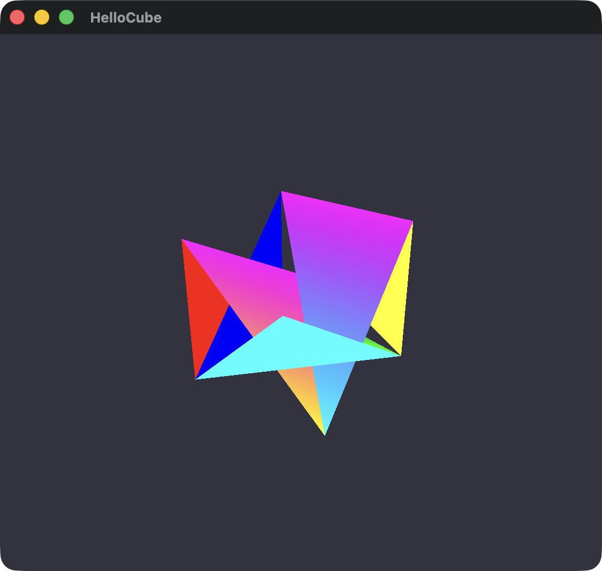
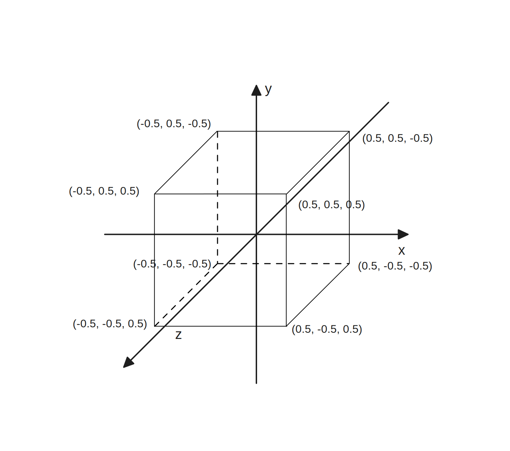
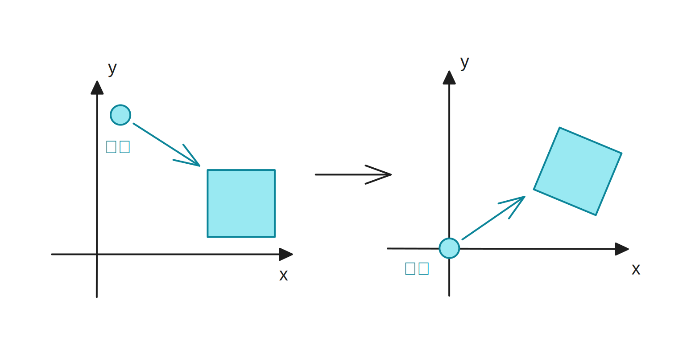
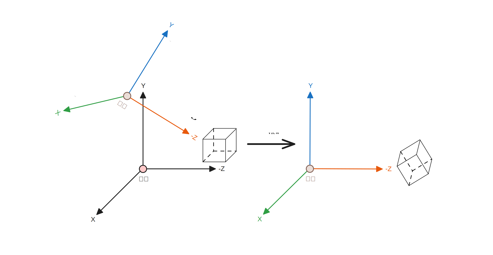
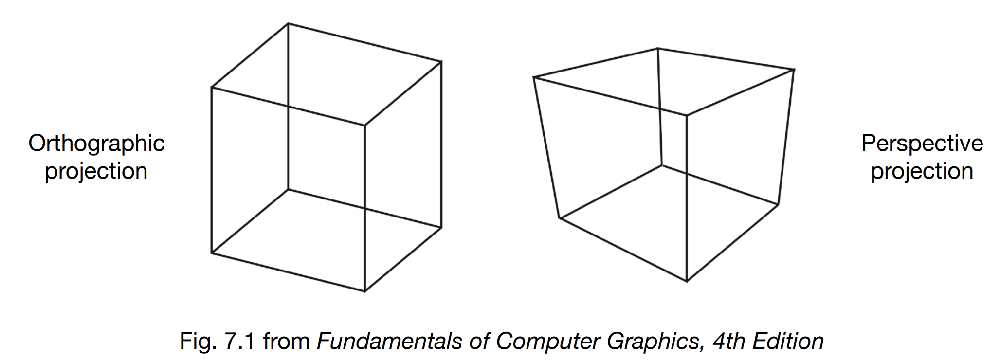

# 你好，Cube

完整代码：



本章节会带你理解光栅化渲染流程，从而了解 3D 模型是如何通过数学计算变换到屏幕像素上的，需要下载该工程作为起点：


初始工程


#### 发生了什么？

Hello Cube 工程将三角形的三个顶点坐标变成立方体所需要的24个顶点

同时需要为 GPU 指出绘制立方体的顶点索引，给 GPU 一个绘制顶点的顺序

通过 Index Buffer 让 GPU 按照期望的顺序去绘制

<details>

<summary>顶点数组</summary>


```swift
let vertices: [Vertex] = [
    // 前面
    Vertex(position: SIMD3<Float>( 0.5,  0.5,  0.5), color: SIMD4<Float>(1.0, 0.0, 0.0, 1.0)),
    Vertex(position: SIMD3<Float>(-0.5,  0.5,  0.5), color: SIMD4<Float>(1.0, 0.0, 0.0, 1.0)),
    Vertex(position: SIMD3<Float>(-0.5, -0.5,  0.5), color: SIMD4<Float>(1.0, 0.0, 0.0, 1.0)),
    Vertex(position: SIMD3<Float>( 0.5, -0.5,  0.5), color: SIMD4<Float>(1.0, 0.0, 0.0, 1.0)),
    
    // 后面
    Vertex(position: SIMD3<Float>( 0.5,  0.5, -0.5), color: SIMD4<Float>(0.0, 1.0, 0.0, 1.0)),
    Vertex(position: SIMD3<Float>(-0.5,  0.5, -0.5), color: SIMD4<Float>(0.0, 1.0, 0.0, 1.0)),
    Vertex(position: SIMD3<Float>(-0.5, -0.5, -0.5), color: SIMD4<Float>(0.0, 1.0, 0.0, 1.0)),
    Vertex(position: SIMD3<Float>( 0.5, -0.5, -0.5), color: SIMD4<Float>(0.0, 1.0, 0.0, 1.0)),
    
    // 左面
    Vertex(position: SIMD3<Float>(-0.5,  0.5,  0.5), color: SIMD4<Float>(0.0, 0.0, 1.0, 1.0)),
    Vertex(position: SIMD3<Float>(-0.5,  0.5, -0.5), color: SIMD4<Float>(0.0, 0.0, 1.0, 1.0)),
    Vertex(position: SIMD3<Float>(-0.5, -0.5, -0.5), color: SIMD4<Float>(0.0, 0.0, 1.0, 1.0)),
    Vertex(position: SIMD3<Float>(-0.5, -0.5,  0.5), color: SIMD4<Float>(0.0, 0.0, 1.0, 1.0)),
    
    // 右面
    Vertex(position: SIMD3<Float>( 0.5,  0.5,  0.5), color: SIMD4<Float>(1.0, 1.0, 0.0, 1.0)),
    Vertex(position: SIMD3<Float>( 0.5,  0.5, -0.5), color: SIMD4<Float>(1.0, 1.0, 0.0, 1.0)),
    Vertex(position: SIMD3<Float>( 0.5, -0.5, -0.5), color: SIMD4<Float>(1.0, 1.0, 0.0, 1.0)),
    Vertex(position: SIMD3<Float>( 0.5, -0.5,  0.5), color: SIMD4<Float>(1.0, 1.0, 0.0, 1.0)),
    
    // 顶面
    Vertex(position: SIMD3<Float>( 0.5,  0.5,  0.5), color: SIMD4<Float>(1.0, 0.0, 1.0, 1.0)),
    Vertex(position: SIMD3<Float>(-0.5,  0.5,  0.5), color: SIMD4<Float>(1.0, 0.0, 1.0, 1.0)),
    Vertex(position: SIMD3<Float>(-0.5,  0.5, -0.5), color: SIMD4<Float>(1.0, 0.0, 1.0, 1.0)),
    Vertex(position: SIMD3<Float>( 0.5,  0.5, -0.5), color: SIMD4<Float>(1.0, 0.0, 1.0, 1.0)),
    
    // 底面
    Vertex(position: SIMD3<Float>( 0.5, -0.5,  0.5), color: SIMD4<Float>(0.0, 1.0, 1.0, 1.0)),
    Vertex(position: SIMD3<Float>(-0.5, -0.5,  0.5), color: SIMD4<Float>(0.0, 1.0, 1.0, 1.0)),
    Vertex(position: SIMD3<Float>(-0.5, -0.5, -0.5), color: SIMD4<Float>(0.0, 1.0, 1.0, 1.0)),
    Vertex(position: SIMD3<Float>( 0.5, -0.5, -0.5), color: SIMD4<Float>(0.0, 1.0, 1.0, 1.0)),
]
```


</details>

<details>

<summary>索引数组</summary>


```swift
// 正方体索引数组，每6个顶点定义一个面（两个三角形）
let indices: [UInt32] = [
    // 前面
    0, 1, 2,  0, 2, 3,
    // 后面
    4, 5, 6,  4, 6, 7,
    // 左面
    8, 9, 10,  8, 10, 11,
    // 右面
    12, 13, 14, 12, 14, 15,
    // 顶面
    16, 17, 18, 16, 18, 19,
    // 底面
    20, 21, 22, 20, 22, 23
]
```


</details>

<details>

<summary>Index Buffer</summary>

为 Renderer 添加属性 Index Buffer，并将 indices 传入

```swift
let indexBuffer: MTLBuffer

self.indexBuffer = device.makeBuffer(
    bytes: indices,
    length: MemoryLayout<UInt32>.size * indices.count
)!
```

修改 Draw，使 GPU 按照索引绘制

```swift
renderEncoder.drawIndexedPrimitives(
    primitiveType: .triangle,
    indexCount: indices.count,
    indexType: .uint32,
    indexBuffer: indexBuffer.gpuAddress,
    indexBufferLength: MemoryLayout<UInt32>.size * indices.count
)
```

</details>

<details>

<summary>Q: 立方体只有 8 个顶点，为什么这里需要 24 个？</summary>

A: 因为在当前案例中，我们希望这个立方体的每个面拥有不同的颜色以便区分，而面的颜色由顶点的颜色决定，所以需要为每一个面都准备四个颜色相同的顶点。

</details>

<details>

<summary>Q: 不定义索引的话会怎样？</summary>

A: 在绘制三角形章节中，由于绘制一个三角形，顺序并不重要，但绘制多面体的话例如当前的立方体，需要明确哪两个三角形连接成立方体的一个面，否则就会出现下面的现象：

<figure><figcaption><p>不明确绘制顺序的立方体，你别说还挺酷的</p></figcaption></figure>

</details>

如果边长为 1 的立方体的几何中心在原点上，那立方体的八个顶点位置就是：

$$
(\pm0.5, \pm0.5)^3
$$



> Metal 视图空间中，相机始终看向 +Z 方向

运行工程，应该能见到这样的画面

<div><figure><figcaption></figcaption></figure> <figure><figcaption></figcaption></figure></div>

似乎不太对劲？和我们期望看到的画面不一样，而右图才是我们希望看见的样子。

我可以负责的告诉你，它确实是一个立方体，但要达到右图的效果，我们需要引入一个新的概念：

## MVP 矩阵

MVP 矩阵为 3D 图形渲染提供了标准化的坐标变换流程，这里只做简单讲解，并不会涉及太多原理，详情可以去看本教程的线性代数部分与光栅化流程 #todo

**设想我们如何拍一张照片？**

* 把希望拍摄的物体放好（模型矩阵 Model Matrix）
* 买一个好相机（Define Camera）
  * 相机有多少像素？（分辨率）
  * 什么样的焦段？（FOV-Y）
* 找一个好的角度（View Matrix）
  * 相机放哪？（Position）
  * 看向什么地方？（Target）
  * 左右旋转角度？（上方向 up Direction）
* 茄子！（Projection Matrix）

> 这里我们只有一个 Cube 且坐标无需变换，所以忽略模型矩阵

#### 定义相机

Models 下创建 Camera.swift，定义出相机的位置与姿态

<details>

<summary>Camera.swift</summary>


```swift
import simd

struct Camera {
    /// 世界空间下的相机位置（Position）
    var position: SIMD3<Float>
    /// 相机注视点（Target）
    var target: SIMD3<Float>
    /// 上方向（一般为(0, 1, 0)）
    var up: SIMD3<Float>
}
```


</details>

接下来会将相机为原点作为一个单独的坐标系，称为视图空间

#### 视图矩阵

在图形学领域，为了方便后续的计算，会将相机看作原点，并且看向 +Z 轴方向，而这一行为会改变整个场景中的所有顶点的坐标，而改变坐标系的这一矩阵

但所有物体都会因为与相机的相对位置不变，所以相机看到的内容是一样的



从三维视角来看是这样的：



在这里并没有发生任何真实的位移，只是因为坐标空间从**世界空间**转换为**视图空间**（相机空间），所以才会使坐标发生变化，相当于更换了参考系。

**推导思路：**

直接求**世界空间**变换到相机的**视图空间**不好求，可以先求**视图空间**如何变换回**世界空间**，这里分开求平移与旋转，而旋转矩阵正好是正交矩阵，所以旋转矩阵进行矩阵转置后，就得到了它的逆矩阵

通过该思路可以写成函数，在 Math 下创建 LookAt.swift

<details>

<summary>LookAt.swift</summary>


```swift
import simd

/// 视图矩阵 View Matrix
/// - Parameters:
///   - eye: 相机位置
///   - target: 目标点
///   - up: 参考上方向向量
func lookAt(eye: SIMD3<Float>, target: SIMD3<Float>, up: SIMD3<Float>) -> float4x4 {
    let zAxis = normalize(target - eye)
    let xAxis = normalize(cross(zAxis, up))
    let yAxis = cross(xAxis, zAxis)
    
    let X = SIMD4<Float>(xAxis.x, yAxis.x, zAxis.x, 0)
    let Y = SIMD4<Float>(xAxis.y, yAxis.y, zAxis.y, 0)
    let Z = SIMD4<Float>(xAxis.z, yAxis.z, zAxis.z, 0)
    let W = SIMD4<Float>(-dot(xAxis, eye), -dot(yAxis, eye), -dot(zAxis, eye), 1)
    
    return float4x4(X, Y, Z, W)
}
```


</details>

#### 透视

熟悉美术的同学应该知道**透视**这个概念，即三维物体在二维平面上，以近大远小的方式呈现出纵深感

而在图形学中，这种行为称为 [tou-ying-projection](../../guang-shan-hua-liu-cheng/mvp-ju-zhen-modelviewprojection/tou-ying-projection/ "mention")

<figure><figcaption><p>左侧为正交投影 Orthographic，右侧为透视投影 Perspective</p></figcaption></figure>

通过定义 **近平面 Near** 与 **远平面 Far**，就能确立投影的可视空间，对于透视投影而言，可视空间就像一个被去了顶的金字塔，称为 **视椎体 Furstum**

<figure><figcaption></figcaption></figure>

而接下来要求的投影矩阵，则是将左图中整个 Frustum，挤压成右图 Cuboid 的形状，我需要你想象一下这个画面：

* 捏住远平面 f 上的四个顶点
* 向内拉动，直到与近平面 n 上的四个顶点平行，组成一个长方体
* 最后再对挤压后的立方体进行正交投影，就得到了我们想要的画面

该操作称为视锥体挤压，也就是我们要求的 **投影矩阵 Projection Matrix**

从一个更好理解的角度看，也就是二维空间去理&#x89E3;**「挤压」**&#x884C;为，假设(x', y', z') 为上图中的 Frustum 的 **近平面「上边」** 的点，(x, y, z) 为 **远平面「上边」** 的点，可以画出示意图：


**推导思路**

<figure><figcaption></figcaption></figure>

再次观察，可以思考出一些特性：

* **特性一：任何一个近平面的点，在挤压后都不会发生任何改变**
* **特性二：任何一个远平面的点，经过变换后 z 值不变**
* **特性三：远平面的中点，在变换后位置也不变**

最终通过（此处省略一万字）计算后，得到：

$$
\mathrm{M_{persp \to ortho}} = \begin{bmatrix}
n & 0 & 0 & 0 \\
0 & n & 0 & 0 \\
0 & 0 & f+n & -nf \\
0 & 0 & 1 & 0 \\
\end{bmatrix}
$$

这就是我们的透视投影矩阵，在 Math 下创建 Perspective.swift

<details>

<summary>Perspective.swift</summary>

同时归一化到 [gui-yi-hua-she-bei-kong-jian-ndcnormalized-device-coordinates.md](../../kong-jian-zuo-biao-xi/gui-yi-hua-she-bei-kong-jian-ndcnormalized-device-coordinates.md "mention") 空间


```swift
import simd

/// 透视投影矩阵
/// - Parameters:
///   - aspect: 宽高比（宽度 / 高度）
///   - fovy: 垂直视野角度（弧度制）
///   - near: 近裁剪平面距离
///   - far: 远裁剪平面距离
func perspective(aspect: Float, fovy: Float, near: Float, far: Float) -> float4x4 {
    let fovYHalf = fovy * 0.5
    let cotHalfFovY = 1.0 / tan(fovYHalf)
    
    // 根据宽高比调整水平缩放
    let scaleX = cotHalfFovY / aspect
    let scaleY = cotHalfFovY
    
    // 将 [near, far] 映射到 [0, 1]
    let zRange = far - near
    let scaleZ = far / zRange
    let offsetZ = -(far * near) / zRange
    
    return float4x4(
        SIMD4<Float>(scaleX, 0,      0,        0),
        SIMD4<Float>(0,      scaleY, 0,        0),
        SIMD4<Float>(0,      0,      scaleZ,   1),
        SIMD4<Float>(0,      0,      offsetZ,  0)
    )
}
```


</details>

#### Uniforms 数据结构

最开始我们使用 MTL Buffer，传递了一些顶点相关的参数，包括顶点的位置、颜色、以及绘制顶点的顺序

但我们也想传一点“全局”一些的东西，比如光照的方向、相机参数、材质属性、时间属性等，适合让 CPU 与 GPU 同时访问的数据，就可以称之为 Uniforms 数据结构

那同时被 CPU 与 GPU 访问，换言之就是能同时被 Swift 与 MSL 访问，这种情况下，使用头文件做数据结构定义就很合适，详情见: [swift-diao-yong-.h-tou-wen-jian.md](../../swift-diao-yong-.h-tou-wen-jian.md "mention")

在 Shaders 内创建 Header 文件：Common.h

<details>

<summary>Common.h</summary>


```cpp
#import <simd/simd.h>

typedef struct {
    matrix_float4x4 mvpMatrix; // MVP 矩阵
} Uniforms;
```


</details>

回到 Renderer，准备 Uniforms Buffer：

```swift
var uniformsBuffer: MTLBuffer // Uniforms 缓冲区

self.uniformsBuffer = device.makeBuffer(
    length: MemoryLayout<Uniforms>.size
)!
```

此时会发现，Xcode 报错找不到 Uniforms：

> **Cannot find type 'Uniforms' in scope**

这是因为 Xcode 会默认将 Swift 和 C/Objective-C 代码严格隔离，不会自动暴露 C 头文件给 Swift 编译器，必须明确注明有哪些 C 代码需要导入

前往项目设置，也就是 Xcode 左侧导航栏上蓝色小锤子，选中对应的 Target，在 Build Settings 中的右上角搜索：**Objective-C Bridging Header**

双击并修改为：`$(SRCROOT)/$(TARGET_NAME)/Shaders/Common.h`

再次编译，就能看到 Xcode Build Success 了

修改参数表部分，把 Uniforms Buffer 传递过去：

<pre class="language-swift"><code class="lang-swift">// 参数表
let argTableDescriptor = MTL4ArgumentTableDescriptor()
<strong>argTableDescriptor.maxBufferBindCount = 2 // 最多可以绑定两个 Buffer
</strong>self.argumentTable = try device.makeArgumentTable(descriptor: argTableDescriptor)
self.argumentTable.setAddress(vertexBuffer.gpuAddress, index: 0) // 将三角形顶点 Buffer 设为第 0 个 Buffer
self.argumentTable.setAddress(uniformsBuffer.gpuAddress, index: 1) // 将 uniformsBuffer 设为第 1 个 Buffer
</code></pre>

#### 开始计算 Uniforms

先在 Renderer 里准备一个 Camera，参数可以自己写

```swift
let camera = Camera(
    position: SIMD3<Float>(2, 2, 3),
    target: SIMD3<Float>(0, 0, 0),
    up: SIMD3<Float>(0, 1, 0)
)
```

在本章节中，我们希望尽可能简单，所以将模型中心放在原点上，并使相机看向原点

准备一个函数，计算 MVP 后将其放入 Uniforms，并发送给 GPU 内存地址：

```swift
func updateUniforms(uniformBuffer: MTLBuffer, aspect: Float) {
    let modelMatrix = matrix_identity_float4x4
    
    let viewMatrix = lookAt(
        eye: camera.position,
        target: camera.target,
        up: camera.up
    )
    
    let projectionMatrix = perspective(
        aspect: aspect,
        fovy: .pi / 4,
        near: 0.1,
        far: 100
    )
    
    // 模型坐标 -> 世界坐标 -> 视图坐标 -> 裁剪坐标
    let mvpMatrix = projectionMatrix * viewMatrix * modelMatrix
    
    var uniforms = Uniforms(mvpMatrix: mvpMatrix)
    
    // 复制到 GPU 缓冲区
    memcpy(uniformBuffer.contents(), &uniforms, MemoryLayout<Uniforms>.size)
}
```

再前往 Draw 函数，在入口处执行 Uniforms 的更新

通过 MTKView 计算宽高比并发送给

```swift
// MARK: - 更新 Uniforms
let aspect = view.drawableSize.width / view.drawableSize.height
updateUniforms(uniformBuffer: uniformsBuffer, aspect: Float(aspect))
```

#### 让 MVP 加入计算

来到 Shaders.metal，在顶部导入头文件 `#import "Common.h"`&#x20;

让 VertexShader 上，传入的 position 乘上 MVP 矩阵

使用 \[\[buffer(1)]] 取出外部 memcpy 传入的整段 Uniforms 内存地址



```cpp
#import "Common.h"

vertex VertexOut vertex_main(VertexIn in [[stage_in]],
                             constant Uniforms &uniforms [[buffer(1)]])
{
    VertexOut out;
    
    // 使用 MVP 矩阵进行坐标变换
    out.position = uniforms.mvpMatrix * float4(in.position, 1.0);
    out.color = in.color;
    
    return out;
}
```



```cpp
#import "Common.h"

// 顶点缓冲区(vertex buffer)传入顶点着色器所用的数据结构
struct VertexIn {
    // float3 position 对应 Swift 中 SIMD3，表示顶点的坐标 xyz
    // [[attribute(0)]] 表示让 Metal 从顶点缓冲区中的第 0 个属性提取数据（通常是位置）作为 position 值
    float3 position [[attribute(0)]];
    
    // float4 color 的四个值是 rgba 颜色，同样 [[attribute(1)]] 表示从用顶点缓冲区的第 1 个属性作为 color
    float4 color [[attribute(1)]];
};

// 顶点着色器根据传入数据 VertexIn 进行一系列改动后，将输出数据打包成 VertexOut
struct VertexOut {
    // 根据 VertexIn 的 position 进行坐标转换，变成 屏幕坐标 后传递给下一阶段
    float4 position [[position]];
    // VertexIn 传入的 color，多数情况为原封不动传递给下一个阶段，但具体如何实现还是看顶点着色器
    float4 color;
};

// vertex: - Metal 修饰符，用于表示该函数为顶点着色器
// VertexOut: - 函数返回值
// vertex_main: - 函数名
// VertexIn in [[stage_in]]: - 输入参数，顶点数据
// constant Uniforms &uniforms [[buffer(1)]]: - uniform 传进来的变换矩阵
vertex VertexOut vertex_main(VertexIn in [[stage_in]],
                             // constant: - 表示 uniform 是只读的，通常视图矩阵由 CPU 计算，所以不需要修改，所以防止意外改动，将其设置为只读
                             // Uniforms: - 表示会解析成这个数据结构
                             // &uniforms: - 表示会引用缓冲区的数据源作为 uniforms，而不会创建一个新的实例
                             // [[buffer(1)]]: - 表示数据源来自传递来的 Buffer 1，根据 setVertexBuffer 的 index 来定
                             constant Uniforms &uniforms [[buffer(1)]])
{
    VertexOut out;
    
    // 使用 MVP 矩阵进行坐标变换
    out.position = uniforms.mvpMatrix * float4(in.position, 1.0);
    
    // 直接传递顶点颜色
    out.color = in.color;
    
    return out;
}

// 片元着色器函数
// fragment: - Metal 修饰符，用于表示该函数为片元着色器
// float4: - 函数返回值，表示 RGBA 颜色值
// fragment_main: - 函数名
// VertexOut in: - 输入参数，传入顶点着色器输出的结构体 VertexOut
fragment float4 fragment_main(VertexOut in [[stage_in]]) {
    return in.color;  // 直接返回从顶点着色器传递过来的颜色值
    // 这里只是把顶点着色器的颜色数据，显示在屏幕上
}
```



至此，应该就能见到一个立方体了：

<figure><figcaption><p>没有处理遮挡关系的 Cube</p></figcaption></figure>

🤬 为什么和预想中的又不一样？

那是因为没有对画面进行深度测试与剔除，不过那是后面要介绍的东西，至此我们已经完成了一个 Cube 的绘制，本篇篇幅较长，涉及知识点比较多，如果你是初学者，可以多看几遍，我把回到顶部按钮放在这里：

<a href="ni-hao-cube.md#fa-sheng-le-shen-me" class="button secondary" data-icon="angle-up">回到顶部</a>
