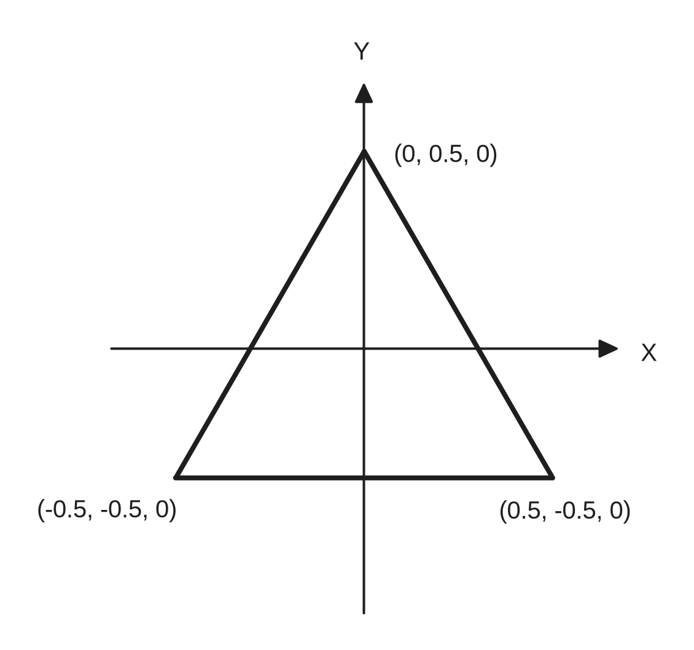

# 你好，三角形

#### 图形学入门第一课！

完整代码：



坐稳了，接下来才是真正有挑战的部分，或许你会反复阅读这篇文章，直到有一次你对渲染管线有

绘制三角形是图形学中的的经典课程，其中经常能见到一些梗图（指花了一下午时间学习了使用图形 API 绘制出第一个三角形，然后放弃）

<figure><figcaption></figcaption></figure>

不过在这之前，先整理一下文件结构方便后续开发，将文件进行归类，下载该工程作为起点：


初始工程


接下来我们会跳过一些复杂抽象的概念（会在后面到教程中讲到），便于逐步理解图形学

#### 开始准备数据结构

在 Models 路径下创建 Vertex.swift 作为顶点坐标数据结构，使用 `SIMD3<Float>` 表示 position 是长度为 3 的定长 Float 数组，SIMD 详情：[simd-shu-ju-jie-gou.md](../xiao-zhi-shi-dian/simd-shu-ju-jie-gou.md "mention")

绘制三角形只需要知道三个顶点的坐标和颜色。



用 SIMD3 创建 position 的 xyz 坐标，用 SIMD4 创建 color 的 rgba 颜色值（a为透明度，即 Alpha 通道）

随后手动定义三个顶点的 Vertex 数组，在 Model 下创建 Vertex.swift


```swift
import simd

struct Vertex { // 顶点数据结构
    /// 顶点坐标 XYZ
    let position: SIMD3<Float>
    /// 颜色 RGBA
    let color: SIMD4<Float>
}

let vertices: [Vertex] = [
    Vertex(position: SIMD3<Float>(0.0,  0.5, 0.0), color: SIMD4<Float>(1.0, 0.0, 0.0, 1.0)),   // 顶点 1 (红色)
    Vertex(position: SIMD3<Float>(-0.5, -0.5, 0.0), color: SIMD4<Float>(0.0, 1.0, 0.0, 1.0)),  // 顶点 2 (绿色)
    Vertex(position: SIMD3<Float>(0.5, -0.5, 0.0), color: SIMD4<Float>(0.0, 0.0, 1.0, 1.0))    // 顶点 3 (蓝色)
]
```


#### 描述数据结构的内存布局

通过打印 `MemoryLayout<SIMD3<Float>>.size/stride/alignment` 可以得知，SIMD3\<Float> 和 SIMD4\<Float> 在设计之初就考虑到了内存对齐 ，都为 16 字节

这个 Vertex 在内存中布局情况是这样的：

| 序号 | 偏移量 | 属性       | 数据           | 数据格式  | 字节排列        |
| -- | --- | -------- | ------------ | ----- | ----------- |
| 0  | 0   | position | (x, y, z)    | SIMD3 | 0-15(16字节)  |
| 1  | 16  | color    | (r, g, b, a) | SIMD4 | 16-31(16字节) |

由此可知，整个 Vertex 的总占用内存大小为 32 字节，那回到 Renderer 的初始化 init 中，做好对该数据结构的内存布局描述，告诉 GPU 要怎么读

在 Renderer 初始化中，根据上表可知：



```swift
// MARK: - 顶点描述符
// 描述顶点内存布局
let vertexDescriptor = MTLVertexDescriptor()
// 配置 position 属性
vertexDescriptor.attributes[0].format = .float3 // 数据类型：3 个浮点数
vertexDescriptor.attributes[0].offset = 0 // position 的偏移量是 0
vertexDescriptor.attributes[0].bufferIndex = 0 // 从第 0 个缓冲区读取数据

// 配置 color 属性
vertexDescriptor.attributes[1].format = .float4 // 数据类型：4 个浮点数
vertexDescriptor.attributes[1].offset = MemoryLayout<SIMD3<Float>>.stride // 偏移量是 16 字节
vertexDescriptor.attributes[1].bufferIndex = 0 // 也从第 0 个缓冲区读取数据

// 定义顶点内存布局
vertexDescriptor.layouts[0].stride = MemoryLayout<Vertex>.stride // 32 字节
// vertexDescriptor.layouts[0].stepRate = 1                         // 步频为 1，不跳过任何顶点
// vertexDescriptor.layouts[0].stepFunction = .perVertex            // 逐顶点处理
```



```swift
init(device: MTLDevice) throws {
    self.device = device
    
    // MARK: - 配置命令队列 Command Queue
    commandQueue = device.makeMTL4CommandQueue()!
    commandBuffer = device.makeCommandBuffer()!
    commandAllocator = device.makeCommandAllocator()!
        
    // MARK: - 顶点描述符
    // 描述顶点内存布局
    let vertexDescriptor = MTLVertexDescriptor()
    // 配置 position 属性
    vertexDescriptor.attributes[0].format = .float3 // 数据类型：3 个浮点数
    vertexDescriptor.attributes[0].offset = 0 // position 的偏移量是 0
    vertexDescriptor.attributes[0].bufferIndex = 0 // 从第 0 个缓冲区读取数据
    
    // 配置 color 属性
    vertexDescriptor.attributes[1].format = .float4 // 数据类型：4 个浮点数
    vertexDescriptor.attributes[1].offset = MemoryLayout<SIMD3<Float>>.stride // 偏移量是 16 字节
    vertexDescriptor.attributes[1].bufferIndex = 0 // 也从第 0 个缓冲区读取数据
    
    // 定义顶点内存布局
    vertexDescriptor.layouts[0].stride = MemoryLayout<Vertex>.stride // 32 字节
    // vertexDescriptor.layouts[0].stepRate = 1                         // 步频为 1，不跳过任何顶点
    // vertexDescriptor.layouts[0].stepFunction = .perVertex            // 逐顶点处理
    
    super.init()
}
```



#### 传递数据至 GPU

绘制三角形需要将顶点数据传递给 GPU，毕竟  GPU 才是干活的

那 CPU 与 GPU 之间的数据传递，CPU 通过 MTLBuffer 将数据传递给 GPU，这里先将三角形的顶点数组做成 Buffer 传递给 GPU

Metal 4 需要使用 ArgumentTable 来描述 Buffer 传递情况



```swift
// MARK: - Buffers
let vertexBuffer: MTLBuffer                     // 顶点缓冲区

// MARK: - State
let argumentTable: MTL4ArgumentTable            // 参数表


// MARK: - 设置 Buffer
// 使用三角形的顶点数组创建 Buffer
self.vertexBuffer = device.makeBuffer(
    // 传递给 GPU 的数据
    bytes: vertices,
    // 数据的字节长度，以 Vertex 的内存大小 * 数组长度计算得出
    length: vertices.count * MemoryLayout<Vertex>.stride
)!


// MARK: - 描述符 Descriptor
// 参数表
let argTableDescriptor = MTL4ArgumentTableDescriptor()
argTableDescriptor.maxBufferBindCount = 1 // 最多可以绑定一个 Buffer
self.argumentTable = try device.makeArgumentTable(descriptor: argTableDescriptor)
self.argumentTable.setAddress(vertexBuffer.gpuAddress, index: 0) // 将三角形顶点 Buffer 设为第 0 个 Buffer
```



```swift
// MARK: - Buffers
let vertexBuffer: MTLBuffer                     // 顶点缓冲区

// MARK: - State
let argumentTable: MTL4ArgumentTable            // 参数表

init(device: MTLDevice) throws {
    self.device = device
    
    // MARK: - 配置命令队列 Command Queue
    self.commandQueue = device.makeMTL4CommandQueue()!
    self.commandBuffer = device.makeCommandBuffer()!
    self.commandAllocator = device.makeCommandAllocator()!
    
    // MARK: - 顶点描述符
    // 描述顶点内存布局
    let vertexDescriptor = MTLVertexDescriptor()
    // 配置 position 属性
    vertexDescriptor.attributes[0].format = .float3 // 数据类型：3 个浮点数
    vertexDescriptor.attributes[0].offset = 0 // position 的偏移量是 0
    vertexDescriptor.attributes[0].bufferIndex = 0 // 从第 0 个缓冲区读取数据
    
    // 配置 color 属性
    vertexDescriptor.attributes[1].format = .float4 // 数据类型：4 个浮点数
    vertexDescriptor.attributes[1].offset = MemoryLayout<SIMD3<Float>>.stride // 偏移量是 16 字节
    vertexDescriptor.attributes[1].bufferIndex = 0 // 也从第 0 个缓冲区读取数据
    
    // 定义顶点内存布局
    vertexDescriptor.layouts[0].stride = MemoryLayout<Vertex>.stride // 32 字节
    // vertexDescriptor.layouts[0].stepRate = 1                         // 步频为 1，不跳过任何顶点
    // vertexDescriptor.layouts[0].stepFunction = .perVertex            // 逐顶点处理
    
    
    // MARK: - 设置 Buffer
    // 使用三角形的顶点数组创建 Buffer
    self.vertexBuffer = device.makeBuffer(
        // 传递给 GPU 的数据
        bytes: vertices,
        // 数据的字节长度，以 Vertex 的内存大小 * 数组长度计算得出
        length: vertices.count * MemoryLayout<Vertex>.stride
    )!
    
    
    // MARK: - 描述符 Descriptor
    // 参数表
    let argTableDescriptor = MTL4ArgumentTableDescriptor()
    argTableDescriptor.maxBufferBindCount = 1 // 最多可以绑定一个 Buffer
    self.argumentTable = try device.makeArgumentTable(descriptor: argTableDescriptor)
    self.argumentTable.setAddress(vertexBuffer.gpuAddress, index: 0) // 将三角形顶点 Buffer 设为第 0 个 Buffer
    
    
    super.init()
}
```



至此，三角形顶点数据已经准备好传递给 GPU 了。

#### Shader！

<details>

<summary>Shaders.metal 完整代码</summary>

```cpp
#include <metal_stdlib>
using namespace metal;

struct VertexIn {
    float3 position [[attribute(0)]];
    float4 color [[attribute(1)]];
};

struct VertexOut {
    float4 position [[position]];
    float4 color;
};

vertex VertexOut vertex_main(VertexIn in [[stage_in]]) {
    VertexOut out;
    out.position = float4(in.position, 1.0);
    out.color = in.color;
    return out;
}

fragment float4 fragment_main(VertexOut in [[stage_in]]) {
    return in.color;
}
```

</details>

Shader 是运行在 GPU 上的程序，但专为并行计算设计，称为着色器，用 **Metal Shading Language (MSL)** 编写

MSL 语言的语法是基于 C++，但做了一些限制与拓展，此处我们不展开 Shader 与 光栅化流程 细讲，先专注于绘制三角形

**顶点着色中的两大 Shader 类型**

* **顶点着色器 Vertex Shader**
  * 处理三维坐标的顶点、法向量、纹理坐标、顶点颜色等等数据
  * 将三维坐标转换为二维的屏幕坐标，装配成一个个图元，送入**光栅化**阶段
* **片元着色器 Fragment Shader**
  * 专门处理光栅化将图元变成离散形式的片元
  * 对像素片元进行颜色混合、测试等操作，最终呈现于屏幕上

这里我们需要使用 Shader 对传入进来的 Vertex Buffer 进行处理，根据 [#miao-shu-shu-ju-jie-gou-de-nei-cun-bu-ju](ni-hao-san-jiao-xing.md#miao-shu-shu-ju-jie-gou-de-nei-cun-bu-ju "mention") 上可得知传入的 Vertex 数据结构的内存布局，接下来在 Shaders 文件夹内，创建 `Shaders.metal` 文件

创建与 [#kai-shi-zhun-bei-shu-ju-jie-gou](ni-hao-san-jiao-xing.md#kai-shi-zhun-bei-shu-ju-jie-gou "mention") 中的 Vertex 对应的 VertexIn 作为输入 VertexBuffer 的数据结构

```cpp
struct VertexIn {
    /// float3 position 对应 Swift 中 SIMD3<Float>，表示顶点坐标 xyz
    // [[attribute(0)]] 表示让 Metal 从顶点缓冲区中的第 0 个属性提取数据作为 position 值
    float3 position [[attribute(0)]];
        // float4 color 的四个值是 rgba 颜色，同样 [[attribute(1)]] 表示从用顶点缓冲区的第 1 个属性作为 color
    float4 color [[attribute(1)]];
};
```

而片元着色器需要将画面显示在屏幕上，对于二维屏幕上绘制三角形而言，只需要知道坐标与颜色

而 VertexOut 则是作为顶点着色器的输出，传递片元着色器所需的参数

```cpp
struct VertexOut {
    // 根据 VertexIn 的 position 进行坐标转换，变成屏幕坐标后传递给下一阶段
    // 用 [[position]] 标记这个参数为「坐标」
    float4 position [[position]];
    // 将顶点颜色原封不动传递给下一阶段
    float4 color;
};
```

#### 顶点着色器 Vertex Shader

准备顶点着色器

```cpp
// 定义顶点着色器函数
// vertex: - Metal 修饰符，用于表示该函数为顶点着色器
// VertexOut: - 函数返回值
// vertex_main: - 函数名
// VertexIn in [[stage_in]]: - 输入参数，定义了一个 VertexIn 类型的 in，将 [[stage_in]] 为缓冲区的数据作为参数传入，也就意味着告诉 Metal 将传入的顶点数据按照 VertexIn 数据结构进行解包
vertex VertexOut vertex_main(VertexIn in [[stage_in]]) {
    // 定义 out 变量
    VertexOut out;
    // 将输入的 position 赋值给 out.position，由于 VertexOut 需要 float4，所以先补一个 1.0 作为齐次坐标
    out.position = float4(in.position, 1.0);
    // 将输入的 color 赋值给 out.color
    out.color = in.color; 
    // 返回 VertexOut
    return out;
}
```

#### 片元着色器 Fragment Shader

```cpp
// 片元着色器函数
// fragment: - Metal 修饰符，用于表示该函数为片元着色器
// float4: - 函数返回值，表示 RGBA 颜色值
// fragment_main: - 函数名
// VertexOut in: - 输入参数，传入顶点着色器输出的结构体 VertexOut
fragment float4 fragment_main(VertexOut in [[stage_in]]) {
    return in.color;  // 直接返回从顶点着色器传递过来的颜色值
    // 这里只是把顶点着色器的颜色数据，显示在屏幕上
}
```

#### 使用 Shader

至此已经完成了 Shader 的编写，回到 Renderer 的初始化 init 中，先加载项目中所有 .metal 文件到 library 中

```swift
let library = device.makeDefaultLibrary()!
```

添加刚才创建好的 [#ding-dian-zhuo-se-qi-vertex-shader](ni-hao-san-jiao-xing.md#ding-dian-zhuo-se-qi-vertex-shader "mention") 和 [#pian-yuan-zhuo-se-qi-fragment-shader](ni-hao-san-jiao-xing.md#pian-yuan-zhuo-se-qi-fragment-shader "mention")，输入函数名就能从 library 中找到



```swift
// MARK: - 加载 Shader
let library = device.makeDefaultLibrary()!

// 顶点着色器
let vertexFunctionDescriptor       = MTL4LibraryFunctionDescriptor()
vertexFunctionDescriptor.library   = library
vertexFunctionDescriptor.name      = "vertex_main"

// 片元着色器
let fragmentFunctionDescriptor     = MTL4LibraryFunctionDescriptor()
fragmentFunctionDescriptor.library = library
fragmentFunctionDescriptor.name    = "fragment_main"

```



```swift
init(device: MTLDevice) throws {
    self.device = device
    
    // MARK: - 配置命令队列 Command Queue
    self.commandQueue = device.makeMTL4CommandQueue()!
    self.commandBuffer = device.makeCommandBuffer()!
    self.commandAllocator = device.makeCommandAllocator()!
    
    
    // MARK: - 顶点描述符
    // 描述顶点内存布局
    let vertexDescriptor = MTLVertexDescriptor()
    // 配置 position 属性
    vertexDescriptor.attributes[0].format = .float3 // 数据类型：3 个浮点数
    vertexDescriptor.attributes[0].offset = 0 // position 的偏移量是 0
    vertexDescriptor.attributes[0].bufferIndex = 0 // 从第 0 个缓冲区读取数据
    
    // 配置 color 属性
    vertexDescriptor.attributes[1].format = .float4 // 数据类型：4 个浮点数
    vertexDescriptor.attributes[1].offset = MemoryLayout<SIMD3<Float>>.stride // 偏移量是 16 字节
    vertexDescriptor.attributes[1].bufferIndex = 0 // 也从第 0 个缓冲区读取数据
    
    // 定义顶点内存布局
    vertexDescriptor.layouts[0].stride = MemoryLayout<Vertex>.stride // 32 字节
    // vertexDescriptor.layouts[0].stepRate = 1                         // 步频为 1，不跳过任何顶点
    // vertexDescriptor.layouts[0].stepFunction = .perVertex            // 逐顶点处理
    
    
    // MARK: - 设置 Buffer
    // 使用三角形的顶点数组创建 Buffer
    self.vertexBuffer = device.makeBuffer(
        // 传递给 GPU 的数据
        bytes: vertices,
        // 数据的字节长度，以 Vertex 的内存大小 * 数组长度计算得出
        length: vertices.count * MemoryLayout<Vertex>.stride
    )!
    
    
    // MARK: - 加载 Shader
    let library = device.makeDefaultLibrary()!
    
    // 顶点着色器
    let vertexFunctionDescriptor       = MTL4LibraryFunctionDescriptor()
    vertexFunctionDescriptor.library   = library
    vertexFunctionDescriptor.name      = "vertex_main"
    
    // 片元着色器
    let fragmentFunctionDescriptor     = MTL4LibraryFunctionDescriptor()
    fragmentFunctionDescriptor.library = library
    fragmentFunctionDescriptor.name    = "fragment_main"
    
    
    // MARK: - 描述符 Descriptor
    // 参数表
    let argTableDescriptor = MTL4ArgumentTableDescriptor()
    argTableDescriptor.maxBufferBindCount = 1 // 最多可以绑定一个 Buffer
    self.argumentTable = try device.makeArgumentTable(descriptor: argTableDescriptor)
    self.argumentTable.setAddress(vertexBuffer.gpuAddress, index: 0) // 将三角形顶点 Buffer 设为第 0 个 Buffer
    
    super.init()
}

```



#### 渲染管线！

创建渲染管线状态

```swift
let pipelineState: MTLRenderPipelineState // 渲染管线状态
```

`RenderPipelineDescriptor` 是渲染管线的最终配置清单，记录了上面我们创建的顶点着色器、片元着色器、顶点内存布局、像素颜色格式等各种配置



```swift
// MARK: - 描述符 Descriptor
// 渲染管线描述符
let pipelineDescriptor = MTL4RenderPipelineDescriptor()
pipelineDescriptor.vertexFunctionDescriptor        = vertexFunctionDescriptor
pipelineDescriptor.fragmentFunctionDescriptor      = fragmentFunctionDescriptor
pipelineDescriptor.vertexDescriptor                = vertexDescriptor
pipelineDescriptor.colorAttachments[0].pixelFormat = .bgra8Unorm // 像素格式


// MARK: - 状态 State
// 创建渲染管线状态
self.pipelineState = try device
    .makeCompiler(descriptor: MTL4CompilerDescriptor())
    .makeRenderPipelineState(descriptor: pipelineDescriptor)
```



```swift

class Renderer: NSObject, MTKViewDelegate {
    let device: MTLDevice                           // GPU 设备
    
    // MARK: - Command Queue
    let commandQueue: MTL4CommandQueue              // 命令队列
    let commandBuffer: MTL4CommandBuffer            // Metal 命令 Buffer
    let commandAllocator: MTL4CommandAllocator      // 命令分配器
    
    // MARK: - Buffers
    let vertexBuffer: MTLBuffer                     // 顶点缓冲区
    
    // MARK: - State
    let pipelineState: MTLRenderPipelineState       // 渲染管线状态
    let argumentTable: MTL4ArgumentTable            // 参数表
    
    init(device: MTLDevice) throws {
        self.device = device
        
        // MARK: - 配置命令队列 Command Queue
        self.commandQueue = device.makeMTL4CommandQueue()!
        self.commandBuffer = device.makeCommandBuffer()!
        self.commandAllocator = device.makeCommandAllocator()!
        
        
        // MARK: - 顶点描述符
        // 描述顶点内存布局
        let vertexDescriptor = MTLVertexDescriptor()
        // 配置 position 属性
        vertexDescriptor.attributes[0].format = .float3 // 数据类型：3 个浮点数
        vertexDescriptor.attributes[0].offset = 0 // position 的偏移量是 0
        vertexDescriptor.attributes[0].bufferIndex = 0 // 从第 0 个缓冲区读取数据
        
        // 配置 color 属性
        vertexDescriptor.attributes[1].format = .float4 // 数据类型：4 个浮点数
        vertexDescriptor.attributes[1].offset = MemoryLayout<SIMD3<Float>>.stride // 偏移量是 16 字节
        vertexDescriptor.attributes[1].bufferIndex = 0 // 也从第 0 个缓冲区读取数据
        
        // 定义顶点内存布局
        vertexDescriptor.layouts[0].stride = MemoryLayout<Vertex>.stride // 32 字节
        // vertexDescriptor.layouts[0].stepRate = 1                         // 步频为 1，不跳过任何顶点
        // vertexDescriptor.layouts[0].stepFunction = .perVertex            // 逐顶点处理
        
        
        // MARK: - 设置 Buffer
        // 使用三角形的顶点数组创建 Buffer
        self.vertexBuffer = device.makeBuffer(
            // 传递给 GPU 的数据
            bytes: vertices,
            // 数据的字节长度，以 Vertex 的内存大小 * 数组长度计算得出
            length: vertices.count * MemoryLayout<Vertex>.stride
        )!
        
        
        // MARK: - 加载 Shader
        let library = device.makeDefaultLibrary()!
        
        // 顶点着色器
        let vertexFunctionDescriptor       = MTL4LibraryFunctionDescriptor()
        vertexFunctionDescriptor.library   = library
        vertexFunctionDescriptor.name      = "vertex_main"
        
        // 片元着色器
        let fragmentFunctionDescriptor     = MTL4LibraryFunctionDescriptor()
        fragmentFunctionDescriptor.library = library
        fragmentFunctionDescriptor.name    = "fragment_main"
        
        
        // MARK: - 描述符 Descriptor
        // 渲染管线描述符
        let pipelineDescriptor = MTL4RenderPipelineDescriptor()
        pipelineDescriptor.vertexFunctionDescriptor        = vertexFunctionDescriptor
        pipelineDescriptor.fragmentFunctionDescriptor      = fragmentFunctionDescriptor
        pipelineDescriptor.vertexDescriptor                = vertexDescriptor
        pipelineDescriptor.colorAttachments[0].pixelFormat = .bgra8Unorm // 像素格式
//        pipelineDescriptor.inputPrimitiveTopology          = .triangle // 默认值
        // 参数表
        let argTableDescriptor = MTL4ArgumentTableDescriptor()
        argTableDescriptor.maxBufferBindCount = 1 // 最多可以绑定一个 Buffer
        self.argumentTable = try device.makeArgumentTable(descriptor: argTableDescriptor)
        self.argumentTable.setAddress(vertexBuffer.gpuAddress, index: 0) // 将三角形顶点 Buffer 设为第 0 个 Buffer
        
        
        // MARK: - 状态 State
        // 创建渲染管线状态
        self.pipelineState = try device
            .makeCompiler(descriptor: MTL4CompilerDescriptor())
            .makeRenderPipelineState(descriptor: pipelineDescriptor)
        
        super.init()
    }
}
```



***

至此，已经完成了渲染管线的配置，接下来才是绘制环节，将目光转向 Draw 函数

#### **设置渲染状态** <a href="#heading95e5460af2b949aba8c0e47aae896fc8-she-zhi-xuan-ran-zhuang-tai-0" id="heading95e5460af2b949aba8c0e47aae896fc8-she-zhi-xuan-ran-zhuang-tai-0"></a>

在 `guard let renderEncoder`  与  `renderEncoder.endEncoding()` 之间添加真正要绘制的元素，将渲染管线

```swift
// MARK: - 设置渲染状态
renderEncoder.setRenderPipelineState(pipelineState)
// 传递顶点数据给 Shader
renderEncoder.setArgumentTable(argumentTable, stages: .vertex)

// 传递顶点数据给 Shader
renderEncoder.setArgumentTable(vertexArgumentTable, stages: .vertex)
```

#### 绘制！

GPU 在得到数组内存地址后，按照 Vertex 的布局情况，分别取三次，拿到了三个顶点

接下来使用 drawPrimitives 函数让 GPU 绘制三角形！

* **type**：图元组装类型，将顶点组装成三角形图元，意味着三个顶点会组合成一个三角形
* **vertexStart**：从第几个顶点开始，此处不进行偏移
* **vertexCount**：顶点数量，此处为数组长度

```swift
renderEncoder.drawPrimitives(
    primitiveType: .triangle,
    vertexStart: 0,
    vertexCount: vertices.count
)
```

<details>

<summary>发生什么事了？</summary>

1. [#chuan-di-shu-ju-zhi-gpu](ni-hao-san-jiao-xing.md#chuan-di-shu-ju-zhi-gpu "mention") 传递了三个 Vertex 顶点组成的数组的内存地址
2. [#miao-shu-shu-ju-jie-gou-de-nei-cun-bu-ju](ni-hao-san-jiao-xing.md#miao-shu-shu-ju-jie-gou-de-nei-cun-bu-ju "mention")传递了 Vertex 的内存布局信息，告诉了 GPU 要如何从数组里面解析成 Vertex（前16字节为 position，后 16字节为 color）
3. 顶点的数量，让 GPU 以 Vertex 的形式取三次并绘制成三角形
4. [#ding-dian-zhuo-se-qi-vertex-shader](ni-hao-san-jiao-xing.md#ding-dian-zhuo-se-qi-vertex-shader "mention") 让每个顶点通过顶点着色器计算，把三维坐标转换为二维的屏幕坐标，将结果（屏幕坐标与顶点颜色）送入光栅化
5. [#pian-yuan-zhuo-se-qi-fragment-shader](ni-hao-san-jiao-xing.md#pian-yuan-zhuo-se-qi-fragment-shader "mention")拿到光栅化后的片元，将颜色显示在片元上

</details>

这下你应该可以看见一个三角形了，是不是感觉压力一下就上来了！没关系，可以多学几遍，下面是回到顶部的按钮，欢迎反复阅读！

<a href="ni-hao-san-jiao-xing.md#tu-xing-xue-ru-men-di-yi-ke" class="button secondary" data-icon="angle-up">回到顶部</a>

