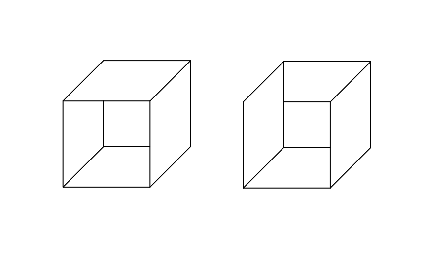
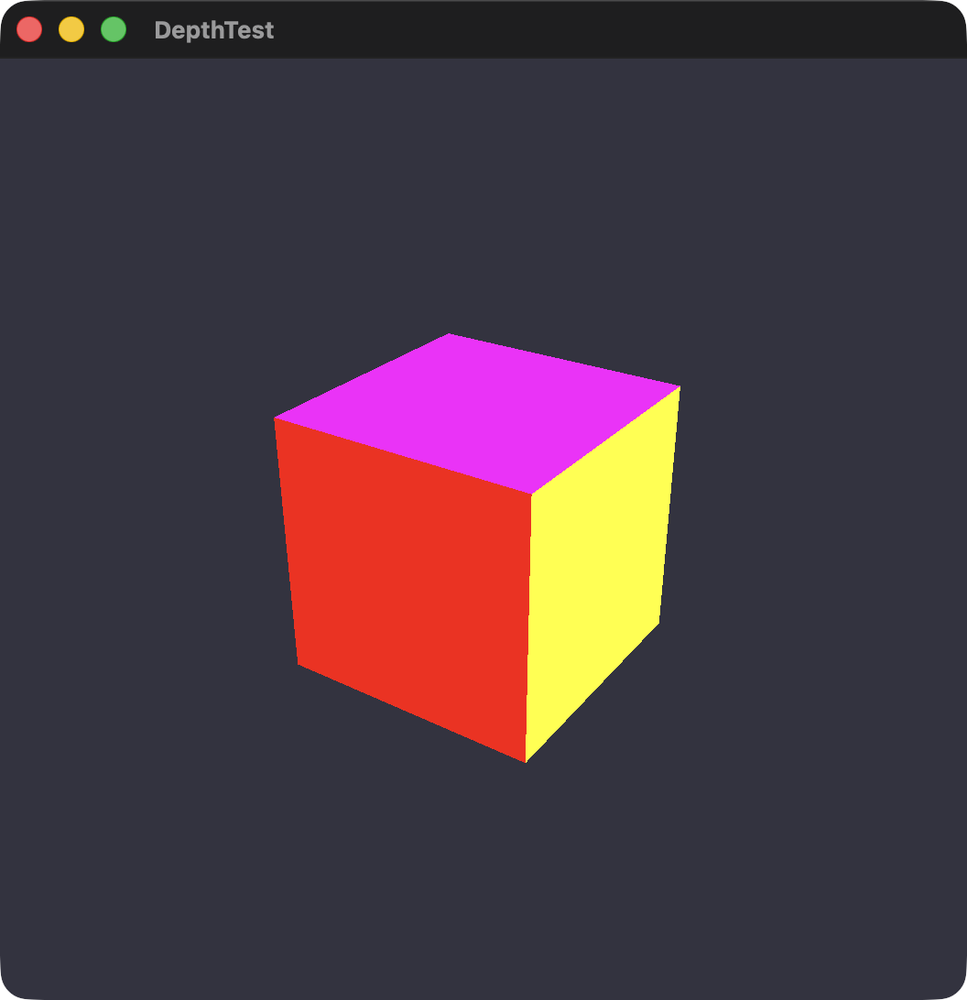

# 深度测试

完整代码：



下载该工程作为起点：



在上一章节，似乎在可见性上出了一些问题？与我们预期中看到的立方体不太一样？

<figure><figcaption><p>没有进行深度测试</p></figcaption></figure>

似乎它的绘制顺序不太对？好像这个立方体没有正面，然后黄色的面被底面挡住了。

这是因为它的绘制顺序是完全基于传递的 index，后绘制的三角形会直接改在先前的三角形上，用一个图来直观的感受绘制顺序错误：



我们告诉了 GPU 要如何按顺序绘制成一个立方体，但由于视角会发生变化，我们并不能定义出绝对的「前面」与「后面」，这时候需要从相机视角出发，让距离三角形更近的三角形代&#x8868;**「前面」**，更远的代&#x8868;**「后面」**

这就有了这节课的主题：

#### 光栅化 Rasterization

仔细观察会意识到，我们并不能将整个三角形全部丢弃，因为在这个立方体上，并没有出现一个三角形被完全覆盖的情况，只是覆盖了一部分，应该去剔除被遮挡的那一部分

那应该是去对屏幕像素进行处理，判断两个三角形显示在屏幕上的那部分被挡住了，在对其进行剔除，那问题就在于，如何将连续的几何三角形，切割成离散的屏幕像素，这一步就是光栅化做的事

在图形学中，我们将连续的三角形称为**图元 Primitive**，而经过光栅化后变为一堆像素组成的片元 Fragment，可以通过下图直观感受他们的区别：


<details>

<summary>Q: 我并没有写光栅化的代码，为什么就已经变成屏幕像素了？</summary>

A: 这是因为 Metal 的默认行为，就是将顶点数据进行光栅化，光栅化的开关在渲染管线描述符中，开启光栅化是它的默认行为，所以无需手动设置：

```swift
pipelineDescriptor.isRasterizationEnabled = true
```

</details>

#### 深度测试 Depth Testing

光栅化会记录下每个像素的 Z 值，这里只需要设计如何处理两个片元在一个像素上的行为就好了，这里光栅化为我们记录的片元 Z 轴映射到了 \[0, 1] 区间，离相机越近，Z 值越接近 0，所以目标就有了：

**让近的片元像素覆盖远的**

好消息是，这在 Metal 中也是傻瓜式开关

来到 Renderer.swif，定义深度测试状态

```swift
var depthState: MTLDepthStencilState
```

在 init 初始化中，创建深度测试

```swift
// MARK: - 深度模板描述符
let depthStateDescriptor = MTLDepthStencilDescriptor()
depthStateDescriptor.depthCompareFunction = .less
depthStateDescriptor.isDepthWriteEnabled = true

// 深度测试
self.depthState = device
    .makeDepthStencilState(descriptor: depthStateDescriptor)!
```

最后前往 Draw 绘制中，在渲染编码器内使用它以便编码给 GPU

```swift
renderEncoder.setDepthStencilState(depthState)
```

得到了我们最终预期的立方体，舒服了

<figure><figcaption></figcaption></figure>
