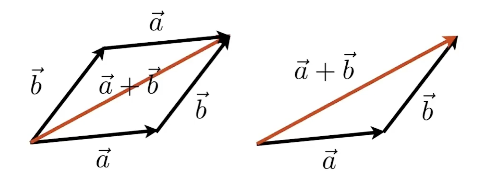

# 模 Magnitude

模的计算同三角函数，假设向量 v = (3, 4)，则长度为 5

假设向量 v = (3, 4, 5)，通过 `length()` 函数传入 [simd-shu-ju-jie-gou.md](../../../xiao-zhi-shi-dian/simd-shu-ju-jie-gou.md "mention") 可计算出长度

```swift
let v = SIMD3<Float>(3, 4, 5)
let magnitude = length(v)  // 计算模（向量的长度）
print(magnitude)  // 输出 7.071068
```

* 可以理解为向量的长度 **`lenth`**
* 也用于辅助计算 [dan-wei-xiang-liang-unit-vector.md](dan-wei-xiang-liang-unit-vector.md "mention")，将一个向量变为**单位向量**的行为称为 [gui-yi-hua-normalization.md](gui-yi-hua-normalization.md "mention")

写作：

$$
||\vec{a}||
$$

向量的模也可以写作： $$|\vec{a}|$$，通常用于只表示向量长度时才会这么写，但不规范。

#### **向量的长度**

通过直角坐标系方便计算，可以通过勾股定理可计算出长度


**计算 3D 向量的长度：** 如果向量是 v = (3, 4, 5)，那么它的长度是：

$$
|v| = \sqrt{x^2 + y^2 + z^2}
$$

$$
= \sqrt{3^2 + 4^2 + 5^2} = \sqrt{9 + 16 + 25} = \sqrt{50} \approx 7.07
$$

向量 (3, 4, 5) 的长度约等于 7.07

所以，向量长度的计算方式都类似，都可以用 `lenth()` 函数计算得出

#### 向量相加

向量遵循平行四边形法则/三角法则

<figure><figcaption></figcaption></figure>
